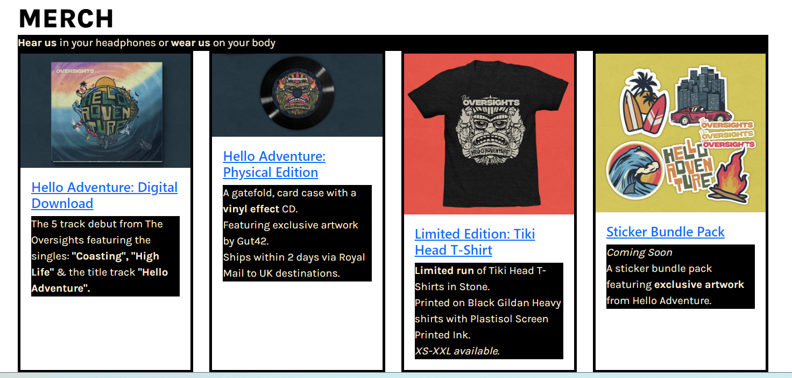
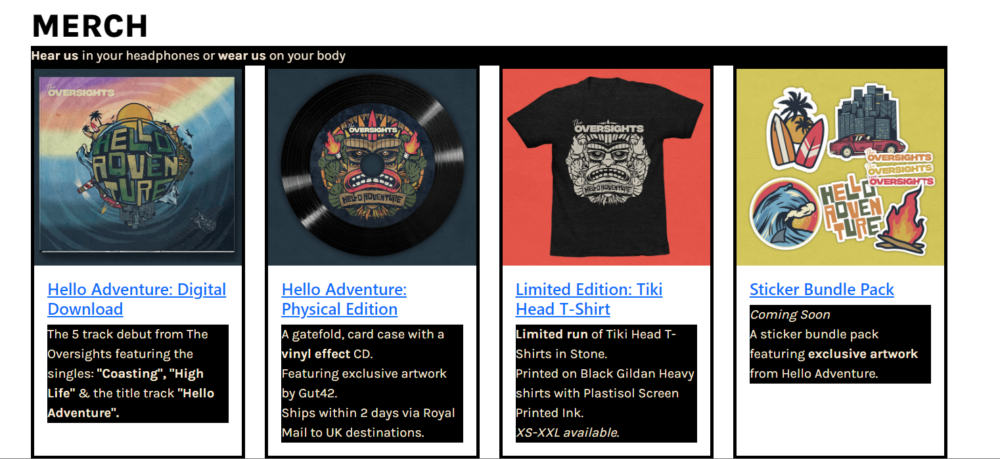
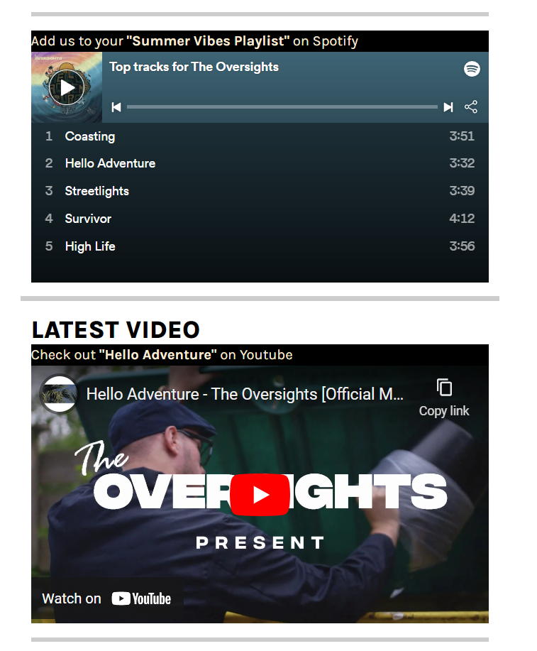
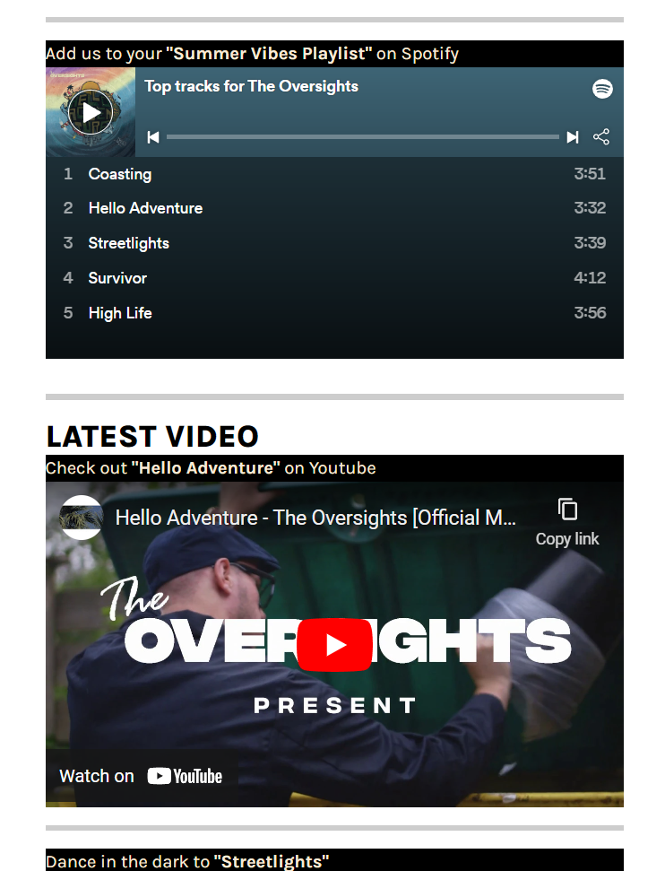

This is the README.md file for my Code Institute project.

I'm currently laying out a "project skeleton" for Initial Commit purposes and will be updating
this more and more as I progress through the project.

## Python Reminder

To run a frontend (HTML, CSS, Javascript only) application in Gitpod, in the terminal, type:

`python3 -m http.server`

**List Example**

- Item 1
- Item 2
- Item 3

**Example**

Examples of code in a box.

```
pkill uptime.sh
rm .vscode/uptime.sh
```
    or just press tab to indent.

---

# The Oversights

## Introduction

**A website for the Newport-based Alt. Rock Band.**

***Personal aims & overview of site***

## Links

[Live Site](/)

[Developers Profile](https://github.com/Hadokane)

[Commit Log](https://github.com/Hadokane/CI_PP1_Oversights/commits?author=Hadokane&since=2022-08-31&until=2022-09-20)

---


## Table of Contents

---

## UX

---

### User Experiences & Goals

------

**Target Audience**

Info goes here.

**First-time User**

Info goes here.

**Returning User**

Info goes here.

**Band / Site owners**

Info goes here.

---

### Design choices

---

**Features**

Info goes here. Mention burger menu on right-hand side being beneficial as most users are right-handed and can then navigate the site comfortably with one hand.

**Wireframes**

Initial wireframe design for the websites home page layout. Includes both mobile & computer.

Shows collapsable nav bar conforming to responsive design best practices.

Features include:
- displaying an external link to the EP or an embedded player from spotify.
- embedding the latest Youtube music video.
- Promoting merchandise to drive sales.
- Including social links in two different accessible places. Changing based on the responsive layout so that they're always convenient for the user to find.


Info goes here.

**Font / Typography**

Info goes here.

**Colour Pallet**

Info goes here.

**Images & Logo Choices**

Info goes here.

## Features of the website

---

## Testing

**Validation Tests**

Info goes here.

**Screen Reader**

Info goes here.

**Different browsers & devices**

Info goes here.

**User stories met?**

Info goes here.

---

## Bugs

Let's hope very few!

1. Using the condensed Padding CSS was not effecting the navbar at all.

        .navbar_links {
            list-style: none;
            padding: 15px, 0px, 0px, 15px;
        }

    The solution was to simply break it up into specific padding commands:

        .navbar_links {
            list-style: none;
            padding-top: 5px;
            padding-left: 15px;
        }
    ---

2. Youtube & Bandcamp's Embeds were unresponsive Iframes by default and needed to be styled in order to adapt to the responsive layout of the website.

    This initial code specified a width and height for the video. 

        <iframe width="560" height="315" src="https://www.youtube.com/embed/DJQ0X-z65oQ" title="YouTube video player" frameborder="0" allow="accelerometer; autoplay; clipboard-write; encrypted-media; gyroscope; picture-in-picture" allowfullscreen></iframe>

    I'd believed that by setting the following, my issues would be solved and the design would become responsive.

            width="100%" height="auto"

    I was incorrect however and although the width now filled the container the videos height became a squashed strip that wouldn't change. The solution was to removed the width & height from the iframe and style it externally in the style.css sheet.
    
    I found guidance from this W3CSchools article. (https://www.w3schools.com/howto/howto_css_responsive_iframes.asp)

    Which taught me that to maintain the 16:9 Aspect Ratio. I needed to set the container to relative and us either top or bottom padding to keep the iframe aligned with my responsive Bootstrap code. 
    
    The 56.25 came from using the needed 16:9 ratio (9/16=0.5625).

        .yt-container {
            overflow: hidden;
            padding-bottom: 56.25%;
            position: relative;
            height: 0;
        }

        .yt-container iframe {
            left: 0;
            top: 0;
            height: 100%;
            width: 100%;
            position: absolute;
        }

    I was then able to adapt this code and alter it for use with the Bandcamp embed, allowing that to also become responsive.
   
    This time to achieve a 9:16 Aspect Ratio instead I used the default height & width values (350/621=1.7778) to determine that "177.78" would be the perfect size for padding.
    
    I adjusted this further to remove some unneccesary blank space from the widget.
    ---

3. Couldn't find a property to change the image sizes within Bootstraps card system. Led to uneven sizing across cards which looks untidy and distracting. Expected adding h-100 to the class would fix it  but this only made sure the cards themselves were the same size, not the space occupied by their contents.
        
        
    Decided to simply resize the images to all have the same proportions within Photoshop and then replace the ones in use. A simple solution that achieved the results I wanted without any code changes.
        

---

4. one of my <-hr-> elements was larger than others. (CSS added specifically for the screenshots to make the problem more visible).
The element was making use of bootstrap code in order to appear only on small devices.


    


SOLUTION: Wrap the initial code within a <-div class="col"-> in order to have it conform to Bootstraps styling.

    <div class="col">
        <hr class="d-none d-sm-block d-md-none">
    </div>
---
   

---


## Future Enhancements

Further store functionality to remove third party website dependency?
Mailing List implementation?

---

## Credits (Programmes / Frameworks / Technologies Used)

---

1. [CI TEMPLATE](https://github.com/Code-Institute-Org/gitpod-full-template) - This repository was initially created using Code Institute's provided template.
2. [Gut42](https://gut42.com/the-oversights-hello-adventure) - For his stellar, commissioned design work on The Oversights album, logos and stickers. Used with permission throughout this website to establish a strong, branded theme.

1. [Markdown Guide](https://www.markdownguide.org/cheat-sheet/) - For use of their "Markdown Cheat Sheet" for the instructional purpose of writing this README.md file.

---

## Deployment

---

---

## Acknowledgements

---

With thanks to:
- My fellow "Oversights" for trusting me with this task and providing helpful feedback throughout.
- My family and friends - for keeping me on task and providing a helpful eye or a pair of testing hands when needed.
- Code Institute & it's community at large, for providing me with the necessary skills, knowledge and guidance to pull this project off.

[Back to top ↑](#the-oversights)

---