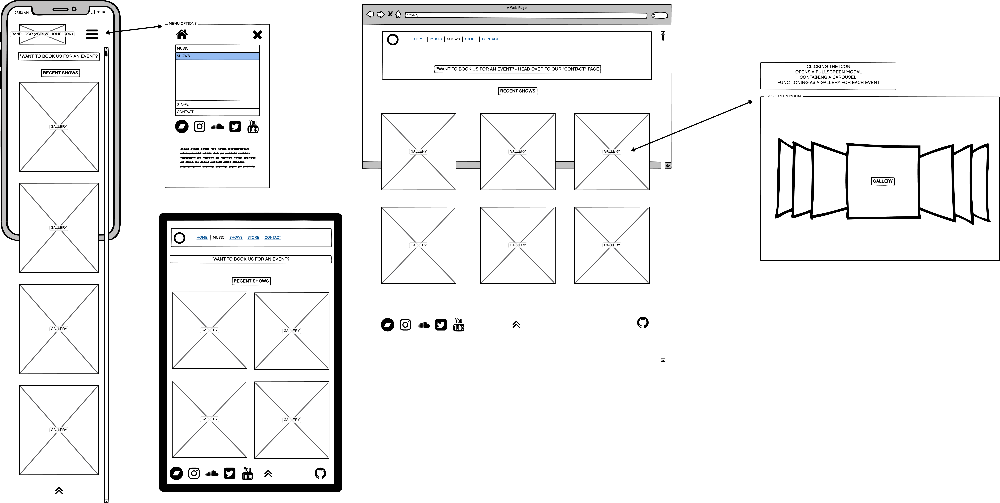
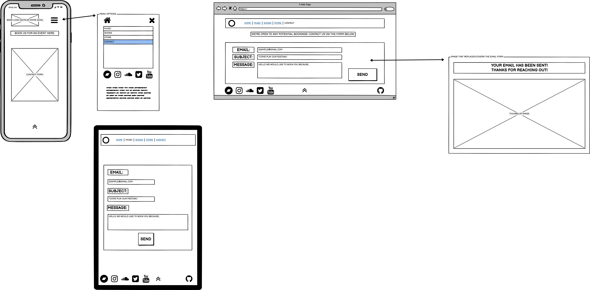
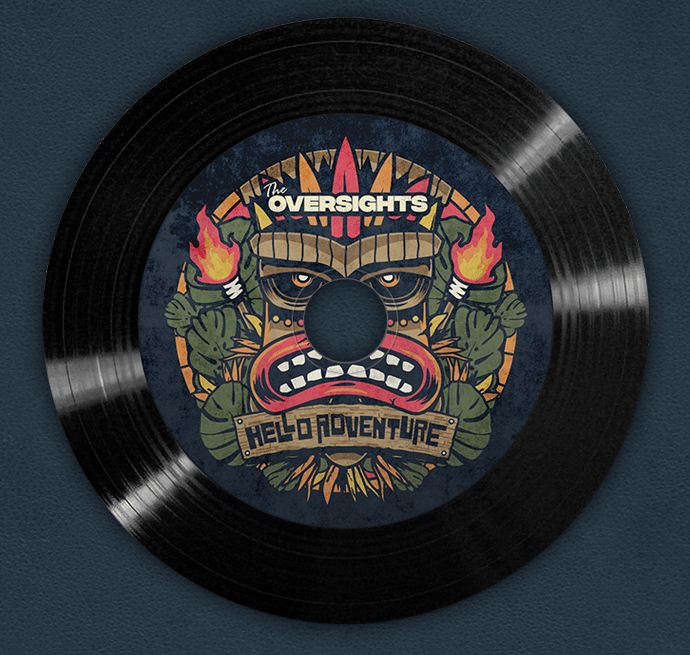
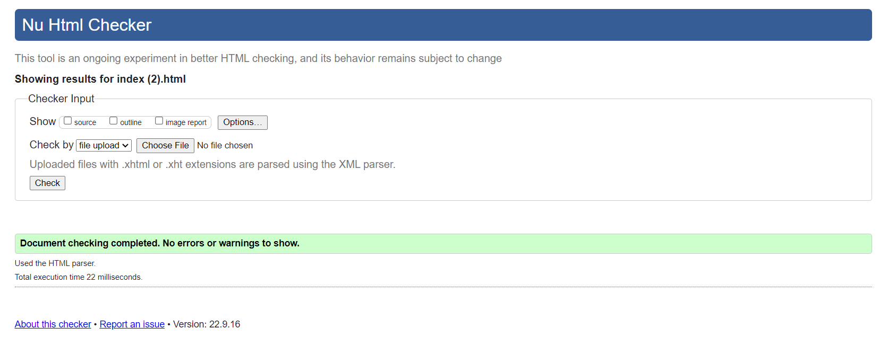
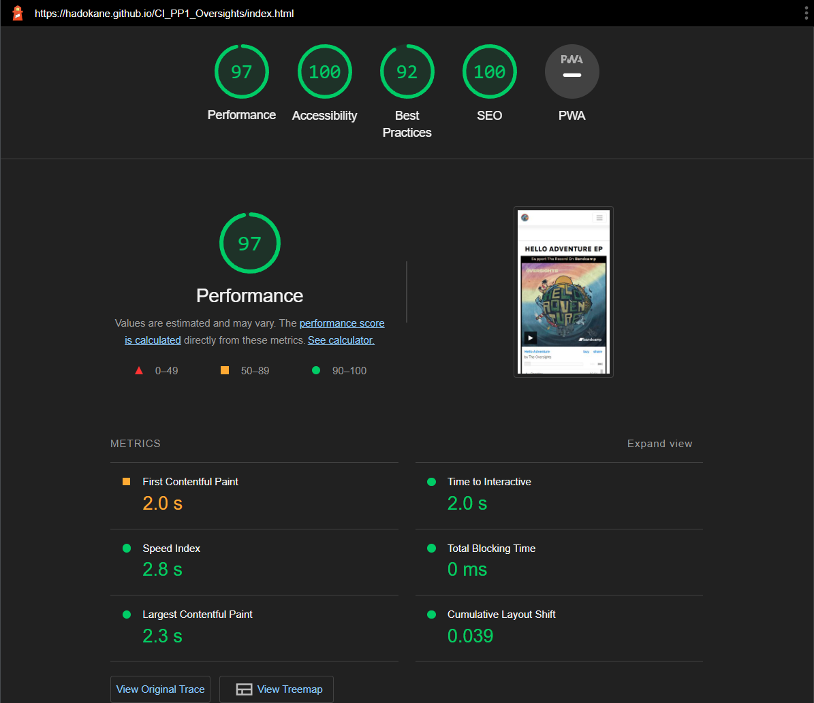

# The Oversights - Band Website

## The digital home of the Newport-based rock band.


**Developer Links:**

*(Right-click to open in a new tab/window)*

[Developer - HK_Dev](https://github.com/Hadokane "Hadokane - Github")

[Commit Log](https://github.com/Hadokane/CI_PP1_Oversights/commits?author=Hadokane)

**Live Website Link:**

[Live Website - The Oversights](https://hadokane.github.io/CI_PP1_Oversights/ "The Oversights")

**Repository Pages:**

[Repository page - Index.html](../CI_PP1_Oversights/index.html)

[Repository page - Music.html](../CI_PP1_Oversights/music.html)

[Repository page - Shows.html](../CI_PP1_Oversights/shows.html)

[Repository page - Contact.html](../CI_PP1_Oversights/contact.html)

[Repository page - Thanks.html](../CI_PP1_Oversights/thanks.html)

---
## Academic Project Aims
---

I am currently pursuing my **Diploma in Web App Development** from [Code Institute](https://codeinstitute.net/ "code institute").

The academic aim of this project is to demonstrate my newly developed skills within the HTML & CSS languages, through the creation of a static, front-end website.

I intend to display this throughout the project via my: coding, comments, commits and explanation provided by this README file.

As such, no other programming languages are directly used. 

However, additional functionality has been provided by the framework [Bootstrap 5.2](https://getbootstrap.com/) and a functional email form is present thanks to [Formsubmit](https://formsubmit.co/).

Great care has been taken, to ensure that the website is designed to meet best practice standards, and is responsive on all screen resolutions.

It has been tested on a variety of devices and screen resolutions, from mobiles to 4k-monitors, and has proven compatibility with all popular web browsers.

---
## Table of Contents
---

1. [User Experience (UX)](#user-experience---ux)
    - [Strategy Plane](#strategy-plane)
        - [User Stories](#user-stories)
    - [Scope Plane](#scope-plane)
    - [Structure Plane](#structure-plane)
        - [Interaction Design (IXD)](#interaction-design---ixd)
    - [Skeleton Plane](#skeleton-plane)
        - [Wireframes](#wireframes)
    - [Surface Plane](#surface-plane)
2. [Features](#features)
3. [Validation Tests](#validation_tests)
    - [HTML Validation](#html-validation)
    - [CSS Validation](#css-validation)
4. [Testing](#testing)
    - [Screen Reader Accessibility](#screen-reader-accessibility)
    - [Performance Testing](#performance-testing)
    - [Device Testing](#device-testing)
5. [Bugs](#bugs)
7. [Deployment](#deployment)
8. [Credits](#credits)
    - [Acknowledgements](#acknowledgements)

---
## User Experience - UX
---

I have decided to arrange my UX analysis by referencing Jesse James Garrett's philosophy of the "5 Planes" framework as discussed in his book [The Elements of User Experience](https://www.amazon.co.uk/Elements-User-Experience-User-Centered-Design/dp/0321683684/ref=asc_df_0321683684/?tag=googshopuk-21&linkCode=df0&hvadid=311000051962&hvpos=&hvnetw=g&hvrand=10376246921916888236&hvpone=&hvptwo=&hvqmt=&hvdev=c&hvdvcmdl=&hvlocint=&hvlocphy=1007448&hvtargid=pla-432330338546&psc=1&th=1&psc=1).

Through this methodology, I will establish the goals of my project, in meeting the needs of both the user and site owner.

I will maintain a clear, justified development path, and establish a defined priority of tasks and elements for integration. Ensuring the project avoids "feature creep," maintains its initial scope and meets the defined user needs.

---
### Strategy Plane
---

**Project Goals**

The aims of this project are: to design a webpage that meets the needs of an established Rock band and their fans, both long-term and new.

**Band Goals:**

The band were interviewed, and together we decided upon the following core goals:

- Promotion of their music and videos (content) is a priority.
- Promotion of their merchandise.
- Increase their social media following.
- Catalogue their releases & shows they've played.
- Improve booking opportunities by providing a method of contact for event managers.

**User Goals:**

Close friends and fans were then interviewed on what features would be important to them:

- Easy access to the band's content.
- Finding desired information with ease.
- Not having to navigate through a cluttered layout.
- Seeing photos from their shows.

**Event Managers:**

An additional group of users that can't be overlooked, are *event managers.*

Their goals would align heavily with the band's goal of "Improving booking opportunities," as they would be offering said opportunities. 
Both parties would be looking for a simple way to communicate and capitalise on each other. 

Therefore their goals would be to:

- Gather more information on the band.
- Contact them with booking information for a show/gig/event.

**User Expectations:**

After carrying out the above research, I have assembled the following "grid of opportunities" to showcase what features to prioritise heading into the next stage of development.

*GRID OF OPPORTUNITIES:*

| Opportunity                        | IMPORTANCE | VIABILITY |
|------------------------------------|------------|-----------|
| Promote Content                    | 5          | 5         |
| Promote Merchandise                | 4          | 3         |
| Gain Social Media Followers        | 4          | 5         |
| Provide Musical Information        | 2          | 4         |
| Provide a functioning contact form | 4          | 2         |

[Back to top ↑](#the-oversights---band-website)

### User Stories
---

The following user stories have been numbered sequentially so that they may be referenced in later sections.

For example: 

    (User stories met: 2, 6, 9)

Would show that:

    First-time User Goals: #2; #6;
    and Returning User Goals: #9;
    have been met by the described element.

**First-time Users:**

1. As a first-time user, I want to be able to find the band's music.
2. As a first-time user, I want to be able to find the band's videos.
3. As a first-time user, I want to read about the band's history.
4. As a first-time user, I want to be able to see a list of shows the band have played.
5. As a first-time user, I want to be able to simply navigate the website.
6. As a first-time user, I want to be able to find links to their social media pages.

**Returning Users**

7. As a returning user, I want to see new content first.
8. As a returning user, I want to find information on new releases.
9. As a returning user, I want to purchase merchandise.
10. As a returning user, I want to see if they're playing a show near me.

**Event Managers**

11. As an event manager, I want to be able to contact the band and receive confirmation the message has been sent.
12. As an event manager, I want to be able to review the band's music to confirm they're a good fit for my event.

**Site Owner**

13. As a site owner, I want to be able to show my content to fans.
14. As a site owner, I want users to have a smooth experience.
15. As a site owner, I want users to see what I have for sale.
16. As a site owner, I want event managers to be able to contact me.
17. As a site owner, I want to increase my social media following.
18. As a site owner, I want to catalogue my live show gallery.

**Competitor Analysis**

With the user stories in mind, I decided it would be prudent to examine what existing websites within the Rock music community offered their fans.

This would be invaluable research as it would allow me to confirm:
- What works visually? (Design, colours, typography, etc.)
- What provided a good user experience? (Navigation methods, buttons, interactivity, etc.)
- How did they meet relevant user needs? 
- What had they done to set/achieve culturally appropriate content? (In this case, the culture of Rock Music as shown in imagery, design, layout etc.)

I examined the following pages:

[The Rolling Stones](https://rollingstones.com/)

[The Beatles](https://www.thebeatles.com/)

[FIDLAR](https://fidlar.komi.io/)

[RHCP](https://redhotchilipeppers.com/)

[Soundgarden](https://www.soundgardenworld.com/)

Seeing their responsive designs between mobile and desktop along with their strong emphasis on a balance between branding and clarity.

This has strengthened my faith in the above user stories and will help shape my thought process as I move through each design plane. 

[Back to top ↑](#the-oversights---band-website)

---
### Scope Plane 
---

It is within this plane that I will address, the features required to meet the established by the "User Stories" section of the Strategy Plane. These goals will allow me to avoid "feature creep" and maintain an agile approach to the development of the website.

**To meet the band's needs:**

- We will showcase their content (Music & Video) front and centre.
    - External iframes will allow us to embed the content directly from their social platforms. This further advertises their channels to users and may lead to conversions and increase their following.
- Merchandise will be featured on the Index page as the second highest priority.
    - Providing an external link to their store in the nav bar, will ensure it's visible from every page of the website.
- Social media icons will be present and frequent throughout the website, without subtracting from the user's experience by cluttering pages.
    - Keep the direct icons in the footer of each page. Allows the user freedom in when they choose to interact with them.
- Provide a "Shows" page to catalogue the band's events and photographs within a gallery section.
- Provide a "Music" page to catalogue the band's releases.
- The design will be kept minimalistic in terms of colour.

**To meet the user's needs:**

The above features already address several needs, such as the content being front and centre and links to the band's external social platforms being readily available on all pages.

To further improve the user's experience we can:
- Move the icons from the footer to the collapsed "hamburger menu" navbar on smaller devices.   
    - This improves the visibility of the icons and the frequency of the user interacting with them. Subtly promoting them without impacting the user's experience.
    - Furthermore, it improves the overall responsive nature of the website across different resolutions and devices.
- Provide a gallery section on the "Shows" page to allow users to view images from the band's recent events.
- The design will be kept minimalistic in terms of colour. Allowing for a smooth user experience. 
    - Avoid cluttered designs, and harsh differences in contrast, while allowing imagery to pop. Ensuring the user has an easier time finding what they need.
- New releases will be highlighted by interesting flavour text and put at the top of pages so returning users will see this first.
- Provide information on the "Music" page. 
    - Summarise the band's history.
    - Describe the releases.
- A contact form will be provided for Event Managers to reach out to the band. Requires only essential information. 

**Features Required:**

The above analysis has led me to plan the following features for implementation on the website. The specific types of content required for each are also mentioned.

The following are written in order of priority and will have dedicated sprints (of ~day) for each element:

- Responsive Navigation Bar
    - The highest priority. Featured on all pages.
    - To comply with best practices and a mobile-first approach to development, the navigation menu will display in full on medium or larger screens, and as a collapsed "hamburger menu" icon on smaller devices.
    - The social media icons will only appear on the collapsed version of the menu to improve their visibility and the user's experience by removing the effort of having them scroll to the bottom of a longer (bootstrap columns filling more of a smaller screen) page to access them.
 - Responsive Footer
    - Featured on all pages. 
    - Responsive nature is important for the user experience. Smaller screen sizes with move social media icons, therefore they are hidden at this size and moved to the nav bar, only being displayed here on larger screens.
    - Include a button to take you back to the top of each page. Saves the user from having to scroll back up, thus improving their overall experience.
- Index Page
    - The home page. The main hub of the website. The place the user will begin their journey.
    - Required: responsive iframes from websites such as Bandcamp, Spotify & Youtube.
    - Bootstrap cards are used to show individual merchandise items in a row.
    - Feature: music; videos; and merchandise; in that priority order.
- Shows Page
    - It was decided it's more beneficial for this to serve as a catalogue of past shows rather than an advertisement for future ones.
    - Gallery section to document past shows.
    - Show a featured image for each. Clicking the image will open a fullscreen gallery. This way the design remains clutter-free and the user can see at a glance, what they're looking for.
- Music Page
    - Article-style layout. Image left-aligned in an aside. Information is present on the right. Give an easy-to-read, minimalistic appearance.
- Contact Form
    - For Event Managers specifically. The least priority as they can - and most likely will - get in touch with the band via social platforms like Facebook and likely make up the smallest pool of users.
    - Use required tags to ensure messages are sent with all relevant information.
    - "Show don't tell" by using contextual icons and example placeholder text such as "John Doe" in inputs. Improves the overall user experience. 
- Bootstrap Alerts 
    - Can be used to provide additional information to users without disrupting the flow of pages.
    - Pre-empt confusion on pages like "shows" with a message redirecting Event Managers to the "contact form" instead.
    - Can be included in the gallery section also to mention that users should head over to Facebook to see recent show announcements. Making them aware that this information isn't present and providing a solution to their problem without them having to search.  

**Road Map:**

These ideas have been postponed for future updates and refinement.

- Shows Page
    - A list of upcoming shows is added at the top. Currently, the band are recording music and has nothing upcoming. As such this section won't be included in this initial sprint. An alert can be included to redirect attention toward their Facebook page. Shows can be announced on short notice, so the viewers benefit more from finding this information on an external social platform.
    - Add [Pagination](https://getbootstrap.com/docs/5.2/components/pagination/) to the Gallery section as more gigs are played.
- Music Page
    - As the band are working on releasing their follow-up EP, a new section can be added to the music page for users to select an EP before then taking them to the current article-styled page, specific to that user's selection.
    - The hierarchy of importance would be adhered to here. Albums would follow a categorical release pattern, with newer releases first. 

[Back to top ↑](#the-oversights---band-website)

---
## Structure Plane:
---

The priority of features was discussed within the above plane but to explain further:

**Feature Priority**

The Index page is logically grouped by having high-priority information front and centre, in this case: the music, videos and merchandise. Boosting the discovery and interactivity of high-priority content by the user.

Lower priority information is then divided by relevance into unique pages. These are presented to the user through the navigation bar, which is accessible from each website page. This provides a simple method of navigation while meeting standard user-defined expectations.

### Interaction-Design - IXD
---

The integration of iframes will:
- Expose the user to the band's social media channels. 
- Encourage user interaction with them.
- Convert the user into a follower/subscriber of the platform.

The presence of icons throughout the website serves many purposes:
- Social media icons are highly recognisable. Used throughout the internet they are expected by the user, who immediately knows that interaction will redirect them - via a new browser tab - to the user-expected platform.
- An icon at the bottom of each screen serves as a link back to the top. This is especially important for users on mobile devices who will be scrolling a large single-column layout. The user's experience is thus drastically improved as we save them from the "finger fatigue" of having to scroll back to the top of each section to revisit an element.

Individual pages will serve their functions but adhere to specific features:
- The expected information will be present on each page
    - E.g. - "Shows" contains the galleries of past shows.
- The page's structure will appear relatively linear and be simple for the user to navigate. 
- Sub-pages will be used sparingly to ensure "everything is accessible from everywhere" for each user.
- Information within these pages will be divided into separate columns featuring informative headers and provocative paragraphs, ensuring the user feels encouraged to interact with featured elements.

Information will be categorised into easy-to-access, informative sections. It will adhere to the goal of providing visual clarity:
- Headers will be informative. Setting the user's expectation for the following section's content.
- Paragraphs - when required - will provide information the user would expect. 
    - E.g. "Music" will contain the release date of the record, information about the songs, and information about the band.
- Links will be descriptive and take the user to where they expect.
- The "hover" class shall improve the link's visibility to the user, improving their interactive experience with the website.
- The interaction can be made more intuitive by using a bright contrasting colour like yellow, to clarify visually to the user that they are interacting with a link.

Overall this website will: 
- Be consistent in design, branding and colours.
- Be predictable and well-labelled.
- Meet pre-defined user expectations.
- Ensure that everything has a clear sense of place.
- Require little-to-no learning by the user. 
- Ensure visiting a page once answers all user questions.
- Provide a visual experience adhering to a "show don't tell" philosophy.
- Provide purposeful paragraphs and headings.
- Provide feedback to the user on interaction through the use of the "hover" class.
- Offer "content hinting" - mainly on the index page - to encourage users to scroll downwards and interact with more content.
- Reward the user with the "UP" icon once reaching the bottom of each page, saving the hassle of scrolling back up, while removing the need for a fixed navigation bar that takes up screen real estate. 

[Back to top ↑](#the-oversights---band-website)

---
## Skeleton Plane
---

The website's data will be presented statically as designated in the project description.
Created entirely with the HTML and CSS languages to handle all data.

**User Value**

The UI serves as the system for the user in this case.
It will be kept clean and simple throughout, remaining clutter-free and featuring only essential elements.
It will also provide immediate interaction for the user, whether first time or recurring.

It will allow immediate interaction for the user. 
- Iframes provide interaction opportunities with external music and videos.
- Icons provide contextual imagery for the user. Enhancing the experience by providing visual metaphors.
- Well sign-posted content and links provide clarity for the user. Providing progressive disclosure for the user, giving them what they need, when they need it.
- Informative headers and paragraphs providing informative prompts and explanations for elements.
- Colourful imagery to draw the user's attention and encourage interaction.
- The priority of information has been factored into the page design to ensure users are met with the most relevant information quickly.
- A simple, navigatable UI ensures users of all ages can comfortably navigate the website on a first visit.
- Each click adds value by leading the user towards their goals, whether that be playing/viewing content or finding information.
- The typography, imagery and hover classes will be used to encourage the user to continue their experience.
- Alerts are used to redirect users to external social platforms to continue their experience of interacting with the band's content. Clarifies situations where a user may be unsure of where to find information providing a positive redirection to their desired location.

These elements will come together with the UI design presented in the next plane to provide users with a positive experience.

**Simplicity of Titles**

The navbar and page names provide the user with a straightforward and expected route to navigate the grouped areas of the website based on their individual needs.

- Interest in the band's recent releases? 
    - Music page.
- Interest in a recent show? 
    - Shows page.
- Are attempting to contact the band with event information? 
    - Contact page.

**Contact Form Layout**

- Name:
- Email:
- Subject:
- Comment:

Following an age-old convention similar to sending an email using a provider, it leads with the name input, followed by email, subject(cc) and ending with a text for the user's comment.

Each input is required by the user for the form to be sent, providing a positive experience for the user by ensuring they are prevented from accidentally sending an incomplete form to the band.

This data is then handled by [FormSubmit](https://formsubmit.co/) and passed onto the band's email, providing the website with a fully functional email form, written entirely in HTML and CSS.

### Wireframes
---

Included below are wireframe designs created with [Balsamiq](https://balsamiq.com/).

This imagery demonstrates the positions of features and elements that compose each page on both mobile devices and computers.
Providing a simplified demonstration of the website's architecture.

Features include:
- Showing how the nav bar conforms to responsive design best practices.
- Displaying example layouts for iframes, headers, icons and text.
- Example layouts for each page and individual section.

<details><summary>Index Wireframe</summary></details>

<details><summary>Music Wireframe</summary></details>

<details><summary>Shows Wireframe</summary></details>

<details><summary>Contact Wireframe</summary></details>

---
## Surface Plane
---

This plane deals with stylistic choices made during the design of the website.

In the following sections, I will describe how the website creates a positive experience for users through its use of hover effects, predictable navigation, clear content, and minimal non-distracting design.

**Design Philosophies**

The website was designed with a mobile-first approach. Bootstrap and Media Queries were used for the arrangement of elements during resizing.

"Content is king" was a priority in this design strategy. With inviting imagery and iframe elements taking priority over text explanations.

This website is here to compliment the band's work and accomplishments, not overshadow or distract from the content presented. It serves as a promotional hub and as such the branding is strong and the backgrounds are kept to a minimal pallet.

**Comfortable Responsive Navigation**

A notable stylistic choice was ensuring the collapsed "hamburger menu" was floated to the right-hand side of the navigation bar.
The benefit of this is that the majority of users can be assumed as right-handed, this layout choice allows them to navigate the site comfortably, on a mobile device, with one hand.

The social media icons are responsively moved from the footer to the "hamburger menu" for this same reason.
Ensuring users can access them with minimal effort, removing the need to scroll the page down and keeping them in view as users navigate the website.

Iframes will be made responsive using CSS to meet user expectations and fit comfortably on all screen sizes.

The navigation bar also houses two additional pages that link to external websites:
- Video which links to Youtube.
- Store which links to the Bandcamp Merchandise page.

This is to encourage the user to follow the band on these platforms. Further promoting the band's social media and providing interaction opportunities for the user.

**Visual Separation**

Visual separation is achieved between sections of the website through the use of <"HR"> tags to create dividing lines. This simple visual, intuitively tells the user when one section ends and another begins.

Drop shadows were added to the navigation bar and footer to provide a sleek sense of elegance and professionalism to the website. This furthers the visual separation between sections with added an added sense of depth and visual clarity.

This approach is taken one step further on the Music page with Vertical line elements being created in CSS to provide visual column separation.

**Colour Pallet**

A modern, minimalistic design was selected for the website. Utilising black, white and grey for all background colours.

Black and White are timeless choices. They will never be out-of-style and provide ideal contrast between elements, avoiding contrast issues, and reducing overwhelming clutter and visual noise.

Grey is utilised for the navigation menu and footer to help them stand out from other sections.


**Hover Colour**

A stylistic choice for the website is utilised when the user's cursor hovers over an interactive link or card. The font colour will change to a bright yellow, with the background colour changing to a black square to provide contrast. This method ensures a user is aware they're currently hovering over an interactive element while positively encouraging them to click/tap.

A further benefit of this minimal colour pallet is that all branding evolves and adapts over time. 
Each album will feature reinventions of their logo, brand colours and imagery. By utilising black and white I've ensured that the website won't need to go through any large revisions. Imagery is updatable and more pages can be added without disrupting the established layout, flow and design.

These colour choices allow the user's eyes to be drawn to selected spots of colour such as:
- The bold Yellow colouration of hovered links
- Imagery added to the website. Which encourages the user to interact with them.
- Ensures visual fidelity of images is maintained as they won't clash with the base design.

**Image Choices**

The colour pallet of the website has been selected to compliment the evocative imagery of the band's albums and merchandise.

The imagery in the merchandise section features colourful backgrounds. Adding personality to the section and encouraging hovering over each card. The user will feel encouraged to approach this section, analyse the items on sale and feel compelled to return to it on future visits.

<details><summary>Album Artwork</summary></details>

<details><summary>Physical CD</summary></details>

<details><summary>Sticker Pack</summary></details>

<details><summary>T Shirt</summary></details>

A collection of sticker assets are used across pages to give the website a **strong** visual style. They filled blank spaces and helped balance the design of pages, ensuring no columns were left unevenly weighted when compared to neighbours.

Additionally, they add to the culturally appropriate image of a rock band. Serving as a subtle advertisement for the band's merchandise across each page, as this sticker pack is for sale.

**Font / Typography**

The colour "Antique White" was utilised in paragraph text throughout the website, to provide visual distinction between this off-white coloured font and the white background of the website sections.

It is used in conjunction with a black background square to match the style of hovered links, blend seamlessly with the border styling present on cards and contribute to the website's overall style.

The band themselves used different fonts than those present on the website in their initial logo. They however do not own the licensing for these fonts to be used online.

As such [Google Fonts](https://fonts.google.com/) was used to obtain similar, legal versions of fonts that the band can use going forwards on future releases. Setting the tone and branding for their next evolution.

The fonts chosen were:
- [Karla](https://fonts.google.com/specimen/Karla)
    - A multi-weight, sans serif font designed by Jonathan Pinhorn. Designed to be very readable and consistent at each weight. Used for all headers and paragraphs to define the visual style of written text.

- [Rubik Mono One](https://fonts.google.com/specimen/Rubik+Mono+One)
    - A rounded, monospace, sans serif font designed by Hubert & Fischer. Used as it was a bold font resembling the band's current logo, making it eye-catching and a logical choice to differentiate the logo from the header text that used Karla.

**Conforming to Culture**

Short provocative statements are made to the user in paragraph section introductions, such as "'Add Us To Your "Summer Vibes Playlist' On Spotify" and "Live The 'High Life' Right Now!" 

These serve as calls to action and encourage users in a culturally appropriate manner to interact with the following elements.

**Contact Form Interaction**

Once submitted, the form will then redirect the user to a "THANK YOU" page, providing positive feedback that their message has been sent to the band.

The navigation bar remains present to allow the user to continue navigating the website without having to use an external mouse or browser button.

The "THANK YOU" page is hidden from the navigation bar and is only called when a user has sent a message.

Icons are present next to the form inputs to provide clarity and serve as visual metaphors to help convey information.

Contacting the band has been made simpler by removing the default CAPTCHA process. Users of the website can now send messages with fewer steps, improving the process.

**Dependencies**

Bootstrap Java dependencies are placed at the bottom of the body tags. CSS dependencies are kept at the top. 

As webpages are loaded Top-Bottom in the HTML file, this should ensure that the page is loaded quickly and helps to ensure that the user doesn't see an unstyled page. 

---
## Features
---

The following section will be examining how the completed website has met the defined user stories.

**Navigation Bar**

*Navigation - Monitor*


*Navigation - Tablet*


*Navigation - Mobile*


The navigation bar is responsive to different screen sizes and present on all pages. It is made up of simple headers and is intuitive to all users.

The currently active page has its header left in black and doesn't respond to being hovered over to dissuade user interaction. Contrastingly, the inactive pages respond by changing background and text colour to encourage user interaction.

The navigation bar is responsive to all device sizes. On mobile devices the menu is condensed into a drop-down menu, freeing up screen real estate and being represented by a recognisable "hamburger" menu. On smaller devices again the band's text logo disappears before overflowing off the side of the screen.

The social icons appear in the "hamburger" menu on mobile devices to be readily available for user interaction.

    User Stories met: 5, 6, 14, 17.

**Footer**

*Footer - Monitor*


*Footer - Tablet/Phone*


The footer is the only other element present on all pages. As such it is responsive. At larger sizes, it contains links to the band's social platforms and on the right contains a link to the developer's GitHub profile.

The social media icons displayed are all well known and use the official branded colours as their button background, ensuring the user has access to each platform and is visually drawn to the links. Each button opens the corresponding page in a new browser tab, keeping the user's session on the band's website undisturbed.

As mentioned, the social icons disappear at smaller sizes, moving to a higher vantage point for the user. The GitHub logo doesn't show on phones as I felt those interested in the development process would likely have viewed it on a larger resolution screen such as a desktop. The promotion of my developer website is in no way a priority.

    User Stories met: 1, 2, 6, 17.

**Index Page**

*Index - Monitor (two-column)*


*Footer - Phone (single-column)* 


*Footer - Phone (single-column)*


*Footer - Phone (single-column)*  **Hover Demonstration**


The "Index" serves as the home page. The section includes a two-column layout, that responsively collapses into a single column at smaller resolutions. 

It provides the user with immediate access to the latest music release and videos via iframes. These have been styled in CSS to make them responsive to the screen size and their containers. Each element is adorned with a provocative message, engaging the user and asking them to interact with the element. These elements also serve as a direct gateway into the band's social platforms.

Below this section is the merchandise tab. The minimalistic layout of the page accentuates the vibrant background colour of these images, drawing the eyes of users, and encouraging clicks. Shopping cart icons are present to show users where to click and provide further visual context.

The hover function is demonstrated here. Showing how the bold colours provide positive feedback to the user upon interaction.

    User Stories met: 1, 2, 7, 8, 9, 12, 13, 15, 17.

**Music Page**

*Music - Monitor (three-column)*


*Music - Phone (single-column)* 


*Music - Phone (single-column)* 


The "Music" page catalogues the band's releases and provides information to the user. It has a strong culturally appropriate style for the band with large imagery present representing their current release. It responsively collapses into a single-column layout for smaller devices, hiding the vertical separation bars.

Vertical separation is present across this three-column layout
giving it a recognisable article/newspaper layout that a user would be comfortable seeing.

Elements such as the iframes present on the first page are repeated here. As the band release more music, the home page will begin to cycle through and replace content to keep the most recent music and videos at the forefront. These pages will remain unaltered, however, serving as a time capsule for each release.

    User Stories met: 1, 3, 8, 12, 13, 17.

**Shows Page**

*Shows - Monitor (single-column)*


*Shows - Monitor (single-column)* **No Alerts**


*Shows - Phone (single-column)* 


*Shows - Monitor (single-column)* **No Alerts**


*Shows - Modal (full-screen)*


"Shows" purpose is to catalogue the events the band plays and serve as a gallery.

It features two Alert messages to improve the page's clarity to the user. These can be hidden by pressing the "X" button on the right-hand side to collapse the page into a more visually pleasing view that makes use of content hinting, exposing the tops of the gallery cards.

Modals are wrapped inside of cards to provide a sleek, simple method of interactivity for the user. The cards keep the page clutter-free and allow strong, cropped hero images to draw the attention of the user, they want to click and see the full image. The full-screen modal then opens up, keeping the user on the current page (and being closable via an "X" button) allowing them to scroll through a varied-size image gallery at adaptive resolutions.

    User Stories met: 3, 4, 10, 12, 18.

**Contact Page**

*Contact - Monitor (single-column)* 


*Contact- Phone (single-column)* 


The "Contact" page provides a functional contact form for Event Managers to contact the band. Creating a more personal means of communication than going through a social channel like Facebook.

This form is designed to be simple and foolproof for the user. Icons and input examples are present to give the user comprehensive assistance in filling in the form.

The built-in CAPTCHA function has been disabled, allowing for a quicker, seamless means of interaction for the user.

Required tags are attached to each user input, helping to ensure they don't accidentally send the form in an incomplete state.
The band will then have all the necessary information to send an informed reply.

Once the form is submitted the user will be taken to the "Thanks" page.

    User Stories met: 11, 16.

**Thanks Page**

*Thanks - Monitor (single-column)* 


*Thanks - Phone (single-column)* 


The thanks page is kept simple. Its sole purpose is to provide a positive user experience by giving them immediate feedback that their form has been sent to the band.

It features a bold "THANK YOU" header, a confirming paragraph stating "We have received your email" and bright branded imagery to convey a feeling of relief and confirmation to the form sender.

    User Stories met: 11, 16.

**Analysis Complete**

With the above assessment complete, I have confirmed that each predefined user story has been met satisfactorily by the features offered.

[Back to top ↑](#the-oversights---band-website)

---
## Validation Tests
---

### HTML Validation

I carried out validation for this project by running each page individually through "[W3C's Validation Service](https://validator.w3.org/)".

**Initial validation**

<details><summary>Index</summary>

</details>

<details><summary>Music</summary>

</details>

<details><summary>Shows</summary>

</details>

<details><summary>Contact</summary>

</details>

<details><summary>Thanks</summary>

</details>

The errors found can be summarised as follows:
- There was an issue with a missing closing tag in the footer, affecting all pages.
- The body tag had been duplicated on a few of the pages.
- The Bandcamp, Spotify and Youtube iframes all made use of inline styling that W3C deemed a failure.
- Some images were missing "alt" tags.
- There was a naming convention error with the sticker images, where I'd forgotten to remove a space from the file names.


**Validation Passes**

I fixed the above issues and ran the pages back through W3C's validation services. 

<details><summary>Index Pass</summary>

</details>

<details><summary>Music Pass</summary>

</details>

<details><summary>Contact Pass</summary>

</details>

<details><summary>Shows Pass</summary>

</details>

<details><summary>Thanks Pass</summary>

</details>


### CSS Validation

I then carried out validation on the project's CSS file by running the page individually through "[W3C CSS Validation Service](https://jigsaw.w3.org/css-validator/)".

<details><summary>CSS Pass</summary>
</details>

The results came back favourably, allowing me to move on to further testing of my project.

[Back to top ↑](#the-oversights---band-website)

---
## Testing
---

### Screen Reader Accessibility

To test the accessibility offered by my code I ran it through [WAVE's Accessibility Evaluator](https://wave.webaim.org/)

**Initial Test**

<details><summary>Wave Test</summary>
</details>

Issues Found:
- Heading levels skipped and H1's not used on pages. Could confuse those using assistive technology such as keyboard navigation.
    - Will address this by introducing a correct heading hierarchy across my website.
- "Home" tab is marked redundant as the website's logo has the same function.
    - The "Home" tab is clear for the user to use and the added functionality being present on the logo provides a larger surface area for users to interact with. 
    - The logo also takes over the function of the home button on smaller screen sizes without the user having to access the "hamburger" menu. Setting it to only function at this size would confuse users and dampen their experience.
    - As such I will keep both to ensure a convenient user experience.
- Alerts about Youtube videos, mentioning it's wise to ensure videos have synchronised captioning available.
    - Youtube does provide captioning for these videos. I can manually add to this if deemed necessary in a future update.
- Mentions how the merchandise tab features a redundant link. Same link for "Hello Adventure: Digital Download" & "Hello Adventure: Physical Edition"
    - This will be left in as it's just the nature of the external website hosting the Physical and Digital editions on the same page. It's more convenient for the user this way. I could rearrange the merchandise icons to avoid this issue but feel it makes more sense to keep these together as they are two purchase options for the same media.
- Social link buttons in the footer and collapsed header missing screen reader labels.
    - Fixed using:
    ```
    <span class="visually-hidden">Descriptive invisible text here</span>
    ```
- Also added an aria-hidden="true" label to Formsubmit's Honey Pot code to solve an error.

**Validation Passed**

<details><summary>Wave Test Passed</summary>
</details>

After fixing the above errors my website passed with no errors.

There were however four contrast errors flagged:

<details><summary>Bandcamp Contrast</summary>
</details>

<details><summary>Spotify Contrast</summary>
</details>

<details><summary>Twitter Contrast</summary>
</details>

<details><summary>Youtube Contrast</summary>
</details>

All of these were due to social media buttons in the footer.

A quick fix for this would be to remove the custom styling for each button and use a default bootstrap dark theme.

I've decided against this, however, as in this instance each icon is using its correct brand colours. These brands are some of the most well-known and visited websites in the world and are recognisable instantly to many from their unique brand colours alone. In this case, I feel it's more beneficial for the user to have instant brand recognition and understanding of each icon over perfect contrast.

### Performance Testing

Google Lighthouse (in Chrome Developer Tools) allows me to test the individual performance of each page, on both mobile and desktop devices.

Testing convinced me to include "picture" tags on the Shows page, allowing browsers to first display the images in .webp format, having the more supported but resource-hungry .png to fall back on.

Below is a list of screenshots confirming the results:

**Desktop**

<details><summary>Lighthouse Index Results</summary>
</details>

<details><summary>Lighthouse Music Results</summary>
</details>

<details><summary>Lighthouse Shows Results</summary>
</details>

<details><summary>Lighthouse Contact Results</summary>
</details>

<details><summary>Lighthouse Thanks Results</summary>
</details>

**Mobile**

<details><summary>Lighthouse Index Mobile Results</summary>
</details>

<details><summary>Lighthouse Music Mobile Results</summary>
</details>

<details><summary>Lighthouse Shows Mobile Results</summary>
</details>

<details><summary>Lighthouse Contact Mobile Results</summary>
</details>

<details><summary>Lighthouse Thanks Mobile Results</summary>
</details>

### Device Testing

The website was tested and functioned as expected on the following devices:

- Novatech LTD. AMD Ryzen 7 3800x, 32GB Desktop
- Lenovo IdeaPad 5 Pro
- Samsung Galaxy S20 & S21
- Samsung Galaxy Tab S7
- MacBook Air with M1 chip
- iPhone 11
- Samsung Chrome Book

The website has been tested on up-to-date versions of the following browsers:

Microsoft Edge
Google Chrome
Chrome for android
Mozilla Firefox
Opera
Safari
Internet Explorer

The website has also been tested on monitors of 16:9, 16:10 and 21:9 resolutions.

[Back to top ↑](#the-oversights---band-website)

---
## Bugs
---

**BUG #1**

Using the "Padding" CSS function was not affecting the bootstrap navbar at all.

```
.navbar_links {
    list-style: none;
    padding: 15px, 0px, 0px, 15px;
    }
```

The solution was to simply break it up into specific padding commands:

```
.navbar_links {
    list-style: none;
    padding-top: 5px;
    padding-left: 15px;
    }
```

**BUG #2**

Youtube & Bandcamp's iframes were unresponsive by default. They require CSS styling to conform the iframe to the responsive layout of the website.

This initial code specified the width and height of the video's container. 

```
<iframe width="560" height="315" src="https://www.youtube.com/embed/DJQ0X-z65oQ" title="YouTube video player" frameborder="0" allow="accelerometer; autoplay; clipboard-write; encrypted-media; gyroscope; picture-in-picture" allowfullscreen></iframe>
```
I believed that by setting the following, my issues would be resolved and the design would become responsive.

```
width="100%" height="auto"
```
I was incorrect, however. The width now filled the container but the height of the video became squashed, cropping the top and bottom.

The solution was to remove the width and height from the iframe and style it externally in the style.css sheet.

I found guidance from this [W3CSchools article](https://www.w3schools.com/howto/howto_css_responsive_iframes.asp). Which taught me that to maintain the 16:9 Aspect Ratio. I was required to set the container to a relative position and use either top or bottom padding to keep the iframe aligned and responsive. 

```    
/*---The 56.25 came from using the needed 16:9 ratio (9/16=0.5625).*/

.yt-container {
    overflow: hidden;
    padding-bottom: 56.25%;
    position: relative;
    height: 0;
    }

.yt-container iframe {
    left: 0;
    top: 0;
    height: 100%;
    width: 100%;
    position: absolute;
    }
```

I was then able to adapt this code and alter it for use with the Bandcamp iframes, allowing that to conform to the responsive design.

```   
This time to achieve a 9:16 Aspect Ratio: 
I used the default height & width values (350/621=1.7778) to determine that "177.78" would be the perfect padding size.
I adjusted this further to remove some blank space from the iframe.
```

**BUG #3**

I couldn't find a property to change the image sizes within Bootstrap's card system. This led to uneven sizing across cards, which looks untidy and visually distracting. 
I Expected adding "h-100" to the class would fix the issue. But this only made sure the cards themselves were the same size, not the space occupied by their contents.

        
I decided to simply resize the images themselves to all have the same proportions (height & width) within Photoshop. I then replaced the ones in use.
This was a simple solution that achieved the results I wanted, without any major code changes.


**BUG #4**

One of my "hr" elements was appearing wider than the others. The element was making use of bootstrap code to appear only on small-resolution devices.

CSS has been added specifically for the screenshots to make the problem more visible.


The solution was to wrap the initial code within a "column" class to conform it to Bootstrap's styling:

```    
 <div class="col">
    <hr class="d-none d-sm-block d-md-none">
 </div>
 ```


**BUG #5**

The brand text was forcing the "hamburger" menu onto the line below on smaller devices (< 450px). Utilising Bootcamp's grid system and breakpoints only seemed to remove my icon as well as the band logo text. This left the navigation bar with no branding and moved the "hamburger" menu to its default position of floating left, which I didn't want. 


I decided the simple method would be to use a media query to hide just the brand text on smaller devices. Leaving the "wave logo" imager present in the nav bar - to maintain branding - and keeping the "hamburger" menu on the right-hand side where users would expect it to be.

```
/*--- Prevents the Brand text from pushing the navbar to the line below. Disappears beforehand, leaving the logo visible*/
@media screen and (max-width: 450px) {
    .navbar-brand{
        width: 0;
        font-size: 0;
    }
}
```

**Remaining Bugs**

The form "submit" button can be spam-clicked causing the same message to be sent multiple times. This was caused by disabling the CAPTCHA and re-enabling it would prevent the problem.
However, Gmail collapses these multiple messages into a single alert meaning that if it were to occur, it wouldn't be an issue for the Band receiving the messages.

Therefore the CAPTCHA has been left disabled for the time being to facilitate more beneficial user interaction.

[Back to top ↑](#the-oversights---band-website)

---
## Deployment
---

The website was deployed on GitHub through the following steps:

1. Login into GitHub and navigate to this repository - [CI_PP1_Ninja_Ramen](https://github.com/Hadokane/CI_PP1_Oversights)
2. Head to the "Settings" tab on the navigation menu and select it.
3. On the left sidebar select "Pages".
4. Under "Build and deployment" you will see a heading names "Source". Click on the dropdown menu and select: "Branch: main" leaving the file as "/(root)"
5. Click the save button.
6. A URL will appear in your newly deployed repository.
7.  GitHub will process your request and the bar's colour will change from blue to green on a page refresh, indicating that the page has been deployed.
8. The website is now live and deployed at the following URL: https://hadokane.github.io/CI_PP1_Oversights/


**Forking**
1. Login into GitHub and navigate to this repository - [CI_PP1_Ninja_Ramen](https://github.com/Hadokane/CI_PP1_Oversights)
2. Select the "Fork" tab on the navigation menu.
3. Choose a destination to save your newly forked repository.

[Back to top ↑](#the-oversights---band-website)

---
## Credits 
---

### Languages Used

- HTML 5
- CSS 3

### Frameworks Used

- [Bootstrap 5.2](https://getbootstrap.com/) - For their approchable, responsive grid system.
- [Formsubmit](https://formsubmit.co/) - For their easy HTML-only approach to a functional contact form.

### Validators Used

- [W3C HTML Validator](https://validator.w3.org/) - Validation of HTML
- [W3C JigSaw Validator](https://jigsaw.w3.org/css-validator/) - Validation of CSS
- [Lighthouse & Chrome DevTools](https://developer.chrome.com/docs/devtools/) - Performance testing
- [Webaim](https://wave.webaim.org/) - Accessibility testing

### Technologies Used

1. [CI TEMPLATE](https://github.com/Code-Institute-Org/gitpod-full-template) - This repository was initially created using Code Institute's provided template.

2. [Gut42](https://gut42.com/the-oversights-hello-adventure) - For his stellar, commissioned design work on The Oversights album, logos and stickers. Used with permission throughout this website to establish a strong, branded theme.

3. [Markdown Guide](https://www.markdownguide.org/cheat-sheet/) - For use of their "Markdown Cheat Sheet" for the instructional purpose of writing this README.md file.

4. [Code-Boxx](https://code-boxx.com/html-scroll-to-top-button/) - For providing a simple, Javascript-free method of making a "return to the top" button.

5. [USBrandcolors](https://usbrandcolors.com/) - Giving me the correct brand hex colours - for Youtube, Spotify Bandcamp, etc. - to use for the background of the social media buttons.

6. [Font Awesome](https://fontawesome.com/) - For their free library of useful contextual icons. Helping to provide visual clarity to the "contact form" and decorative elements to the "music" page.

7. [Compressjpeg](https://compressjpeg.com/) - For allowing me to compress images and keep image file size down.

8. [AnyWebp](https://anywebp.com/convert-to-webp.html) - For allowing me to convert images into a .webp format for use in picture elements, to improve the mobile functionality scores of the website.

9. [Grammarly](https://app.grammarly.com/) - for spell-checking this README.

10. [Youtube - A Designer Who Codes](https://www.youtube.com/watch?v=Yg6POD0M30w&ab_channel=ADesignerWhoCodes) - For creating a helpful tutorial on making functioning HTML-only email forms.

11. [Am I Responsive](https://ui.dev/amiresponsive) - For providing the mock-up image featured at the top of this document.

12. [Google Fonts](https://fonts.google.com/) - For access to their wealth of commercially-available fonts.

13. [Favicon.io](https://favicon.io/) - For converting our logo into a usable favicon

14. [Balsamiq](https://balsamiq.com/) (create wireframes for the project)

15. [GitHub](https://github.com/) - For serving as my IDE and allowing me to create and deploy my repository.

[Back to top ↑](#the-oversights---band-website)

---
## Acknowledgements
---

With thanks to:
- My fellow "Oversights" for trusting me with this task and providing helpful feedback.

- My family and friends - for keeping me on task and providing a helpful eye and testing device when needed.

- Code Institute & its community at large, for providing me with the necessary skills, knowledge and guidance to pull this project off.

[Back to top ↑](#the-oversights---band-website)

---